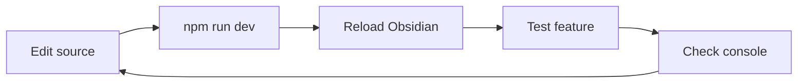

# Development Guide

This document covers setting up a development environment, testing the plugin in Obsidian, and debugging common issues.

## Prerequisites

Install Node.js 18+ (includes npm), which is required for TypeScript compilation and the Claude Agent SDK.

## Development Setup

Clone the repository and install dependencies:

```bash
git clone https://github.com/yourname/obsidian-claude-code
cd obsidian-claude-code
npm install
```

Verify the build works:

```bash
npm run build
```

This produces `main.js` in the repository root, which Obsidian loads as the plugin entry point.

## Loading into Obsidian

Obsidian loads plugins from the `.obsidian/plugins/` directory within a vault. For development, create a symbolic link from your development directory to the vault's plugin folder.

### Symlink Setup

Identify your test vault path. For this example, assume it's at `~/Documents/TestVault`.

Create the plugins directory if it doesn't exist:

```bash
mkdir -p ~/Documents/TestVault/.obsidian/plugins
```

Create a symlink from your development directory:

```bash
ln -s /path/to/obsidian-claude-code ~/Documents/TestVault/.obsidian/plugins/obsidian-claude-code
```

Verify the symlink:

```bash
ls -la ~/Documents/TestVault/.obsidian/plugins/
```

You should see `obsidian-claude-code -> /path/to/obsidian-claude-code`.

### Enabling the Plugin

Open the test vault in Obsidian. Navigate to Settings → Community Plugins. You may need to turn off "Restricted Mode" if this is your first community plugin.

The plugin should appear in the list as "Claude Code". Toggle it on to enable.

If the plugin doesn't appear, check that these files exist in the symlinked directory:
- `manifest.json` (plugin metadata)
- `main.js` (compiled plugin code)

### Hot Reload Development

For active development, run the watch command:

```bash
npm run dev
```

This rebuilds `main.js` on every source file change. To see changes in Obsidian:

1. Open the Command Palette (`Cmd+P`)
2. Run "Reload app without saving" or
3. Disable and re-enable the plugin in settings

Some Obsidian installations support the "Hot Reload" community plugin which automatically reloads when `main.js` changes. Install it from the community plugin browser if available.

## Configuration for Testing

### Authentication

The plugin supports three authentication methods:

**1. API Key in Settings**
Enter your Anthropic API key in Settings → Claude Code → API Key.

**2. Environment Variable**
Set `ANTHROPIC_API_KEY` before launching Obsidian:

```bash
ANTHROPIC_API_KEY=sk-ant-... /Applications/Obsidian.app/Contents/MacOS/Obsidian
```

**3. Claude Max Subscription**
Run `claude setup-token` in your terminal to authenticate with your Claude Pro/Max subscription:

```bash
claude setup-token
```

This creates a `CLAUDE_CODE_OAUTH_TOKEN` environment variable that the plugin detects automatically. The settings page will show which authentication method is active.

### Model Selection

Choose between Sonnet (faster, cheaper) and Opus (more capable) in settings. Sonnet is recommended for iterative testing to minimize API costs.

### Skills Setup (Optional)

To test skill loading, create a skill in your vault:

```bash
mkdir -p ~/Documents/TestVault/.claude/skills/test-skill
```

Create `~/Documents/TestVault/.claude/skills/test-skill/SKILL.md`:

```markdown
# Test Skill

A simple test skill for development.

## Usage
This skill can be invoked to test skill loading.
```

The skill should appear in the SDK's initialization logs.

## Debugging

### Console Access

Obsidian runs on Electron and exposes Chrome DevTools. Access the console via View → Toggle Developer Tools or `Cmd+Option+I`.

The plugin logs key events:
- `[AgentController] Session initialized: {session_id}` on first query
- `[AgentController] Available tools: {tool_list}` showing loaded tools
- `[AgentController] Query completed: {turns} turns, ${cost}` after each response

### Common Issues

**Plugin not appearing in list**

Ensure `manifest.json` is valid JSON with required fields:
```json
{
  "id": "obsidian-claude-code",
  "name": "Claude Code",
  "version": "0.0.1",
  "minAppVersion": "1.4.0",
  "main": "main.js"
}
```

**Build errors**

Check TypeScript errors:
```bash
npm run tsc --noEmit
```

The `--skipLibCheck` flag is included in the build script to bypass declaration file issues in dependencies.

**API connection failures**

Verify your API key is valid:
```bash
curl https://api.anthropic.com/v1/messages \
  -H "x-api-key: $ANTHROPIC_API_KEY" \
  -H "anthropic-version: 2023-06-01" \
  -H "content-type: application/json" \
  -d '{"model":"claude-sonnet-4-20250514","max_tokens":10,"messages":[{"role":"user","content":"Hi"}]}'
```

**Sidebar not opening**

Check if the view is registered correctly in the console:
```javascript
app.workspace.getLeavesOfType('claude-code-view')
```

Should return an array (possibly empty if the view isn't open yet).

**Skills not loading**

Verify the skill directory structure:
```bash
ls -la ~/Documents/TestVault/.claude/skills/
```

Each skill should have a `SKILL.md` file. Check the console for skill loading errors.

**Obsidian tools not working**

Check that the SDK MCP server is initialized:
```javascript
// In console, check for mcp__obsidian__* tools in the init message
```

## Testing Workflow

A recommended sequence for testing changes:



### Feature Testing Checklist

**Chat functionality**
- Send a message and receive a response
- Verify streaming updates the UI incrementally
- Test message markdown rendering

**Built-in tool execution**
- Ask Claude to read a file (`Read` tool)
- Request a file search (`Grep` tool)
- Ask Claude to create a note (`Write` tool, triggers permission if not auto-approved)

**Obsidian-specific tools**
- Ask Claude to open a file (`mcp__obsidian__open_file`)
- Request vault statistics (`mcp__obsidian__get_vault_stats`)
- Ask Claude to run an Obsidian command (`mcp__obsidian__execute_command`)

**Skill execution (if configured)**
- Ask Claude to search notes semantically (vault-search skill)
- Verify skill scripts are executed correctly

**Conversation management**
- Start a new conversation via header button or `/new`
- Verify history persists across plugin reloads
- Open conversation history modal and switch conversations
- Verify session resumption works (messages continue context)

**Autocomplete**
- Type `/` and verify command suggestions appear
- Type `@` and verify file suggestions appear
- Select suggestions with arrow keys and Enter

**Settings**
- Change API key and verify it persists
- Toggle model selection
- Modify auto-approve settings and verify behavior
- Check that env var detection shows correctly

## Project Structure

```
obsidian-claude-code/
├── src/
│   ├── main.ts              # Plugin entry, lifecycle
│   ├── types.ts             # TypeScript interfaces
│   ├── agent/               # Claude Agent SDK integration
│   │   ├── AgentController.ts     # SDK query orchestration
│   │   ├── ConversationManager.ts # Session persistence
│   │   └── ObsidianMcpServer.ts   # Custom Obsidian tools
│   ├── views/               # UI components
│   └── settings/            # Settings tab
├── docs/                    # Documentation
├── main.js                  # Built output (gitignored in prod)
├── manifest.json            # Obsidian plugin manifest
├── styles.css               # Plugin CSS
├── package.json             # Dependencies
├── tsconfig.json            # TypeScript config
└── esbuild.config.mjs       # Build configuration
```

## Build Configuration

The esbuild configuration (`esbuild.config.mjs`) handles Obsidian-specific bundling:

- Externalizes `obsidian`, `electron`, and Node.js built-ins
- Targets ES2020 for modern browser compatibility
- Bundles all dependencies except externals into a single file
- Includes source maps in development mode

Production builds (`npm run build`) enable minification. Development builds (`npm run dev`) watch for changes and rebuild automatically.

## Key Dependencies

- `@anthropic-ai/claude-agent-sdk` - Claude Agent SDK for query() and tool execution
- `zod` - Schema validation for SDK MCP tool definitions
- `obsidian` - Obsidian API types and classes

## Contributing

Before submitting changes:

1. Run type checking: `npm run tsc --noEmit`
2. Build the plugin: `npm run build`
3. Test in a fresh vault
4. Verify console has no errors

Code style follows the patterns established in existing files. Use complete sentences for comments. Prefix CSS classes with `claude-code-`.
