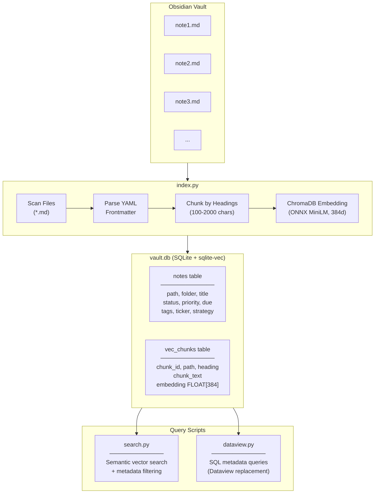

# Vault Search Skill

Semantic search and SQL queries over your Obsidian vault using vector embeddings and SQLite.

## Architecture Overview



## Pipeline Stages

### 1. Indexing (`index.py`)

The indexer scans the vault and builds a searchable database:

```
Vault Files → Parse → Chunk → Embed → Store
```

**File Scanning:**
- Recursively finds all `*.md` files
- Excludes system folders: `.obsidian`, `.smart-env`, `.claude`, `assets`, `Templates`

**Frontmatter Parsing:**
- Extracts YAML frontmatter between `---` markers
- Maps common fields (status, priority, due, tags) to typed columns
- Stores full frontmatter as JSON for flexibility

**Chunking Strategy:**
- Splits content by markdown headings (`#`, `##`, `###`)
- Each chunk includes heading context
- Minimum 100 characters per chunk
- Maximum 2000 characters per chunk
- Fallback: entire note as single chunk if no headings

**Embedding Generation:**
- Uses ChromaDB's `DefaultEmbeddingFunction`
- Model: ONNX MiniLM-L6-v2 (runs locally, no API calls)
- Output: 384-dimensional float vectors
- Batch processing: 100 chunks at a time

### 2. Semantic Search (`search.py`)

Vector similarity search with optional metadata filtering:

```
Query → Embed → Vector Match → Join Metadata → Filter → Results
```

**Query Flow:**
1. Embed user query using same MiniLM model
2. Find nearest vectors using `sqlite-vec` MATCH operator
3. Join with `notes` table for metadata
4. Apply optional WHERE filters (folder, status, etc.)
5. Return ranked results with snippets

**sqlite-vec Integration:**
- Virtual table with vector column: `embedding FLOAT[384]`
- Uses L2 distance for similarity ranking
- Efficient approximate nearest neighbor search

### 3. Metadata Queries (`dataview.py`)

Direct SQL access to frontmatter metadata:

```
SQL Query → Execute → Format → Results
```

**Capabilities:**
- Full SQL syntax (SELECT, WHERE, JOIN, GROUP BY, etc.)
- JSON functions for array fields (`json_each` for tags)
- Date functions for due/scheduled filtering
- Aggregations for dashboards and summaries

## Database Schema

### `notes` Table

| Column | Type | Description |
|--------|------|-------------|
| path | TEXT (PK) | Relative path from vault root |
| folder | TEXT | Parent folder(s) |
| filename | TEXT | File name with extension |
| title | TEXT | Extracted from H1 or filename |
| modified | REAL | File modification timestamp |
| status | TEXT | Task status (open, done, etc.) |
| priority | TEXT | Priority level |
| due | TEXT | Due date (ISO format) |
| scheduled | TEXT | Scheduled date |
| tags | TEXT | JSON array of tags |
| projects | TEXT | JSON array of projects |
| contexts | TEXT | JSON array of contexts |
| ticker | TEXT | Stock/crypto ticker |
| strategy | TEXT | Investment strategy |
| expiry | TEXT | Option expiry date |
| frontmatter_json | TEXT | Full frontmatter as JSON |

### `vec_chunks` Table (Virtual)

| Column | Type | Description |
|--------|------|-------------|
| chunk_id | TEXT (PK) | `{path}#{index}` |
| path | TEXT | Reference to notes.path |
| heading | TEXT | Section heading |
| chunk_text | TEXT | Chunk content (max 2000 chars) |
| embedding | FLOAT[384] | MiniLM vector embedding |

## Dependencies

| Package | Purpose |
|---------|---------|
| `sqlite-vec` | Vector similarity search extension for SQLite |
| `chromadb` | Embedding function (uses ONNX runtime internally) |
| `pyyaml` | YAML frontmatter parsing |

## Performance Characteristics

- **Index build**: ~1-2 minutes for 1000 notes (depends on chunk count)
- **Search latency**: <100ms for typical queries
- **Database size**: ~50-100MB for 1000 notes with embeddings
- **Memory**: ~500MB during indexing (embedding model), minimal at runtime

## Extending the Schema

To index custom frontmatter fields:

1. Add column to `notes` table in `index.py`:
   ```python
   conn.execute("""
       CREATE TABLE IF NOT EXISTS notes (
           ...
           my_custom_field TEXT,
           ...
       )
   """)
   ```

2. Extract field in `insert_note()`:
   ```python
   my_custom_field=serialize(fm.get("my_custom_field")),
   ```

3. Rebuild index:
   ```bash
   python index.py --rebuild
   ```

## Limitations

- **No incremental updates**: Currently rebuilds entire index (TODO: track file hashes)
- **English-optimized**: MiniLM trained primarily on English text
- **Heading-based chunking**: May split related content; semantic chunking would be better
- **No cross-note references**: Doesn't index wikilinks or backlinks (future enhancement)
